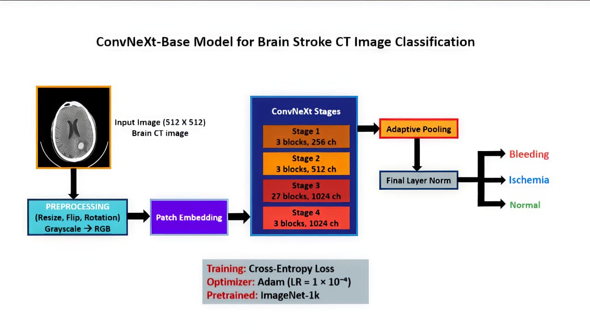
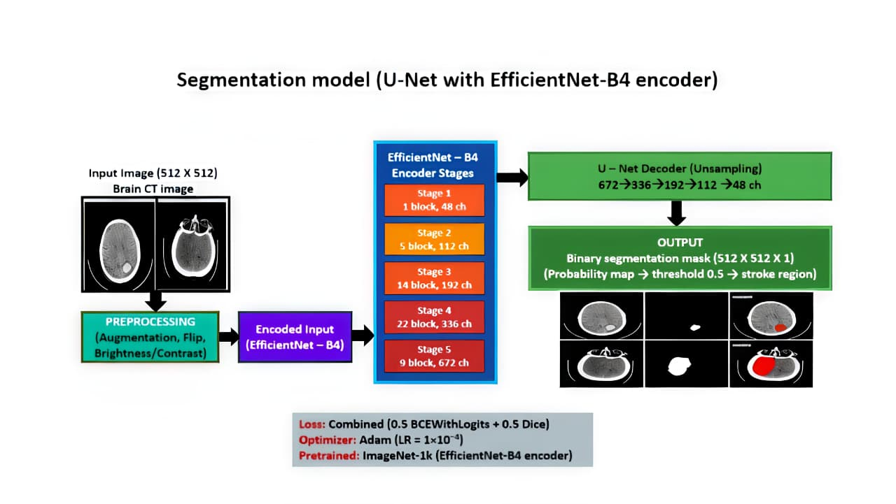
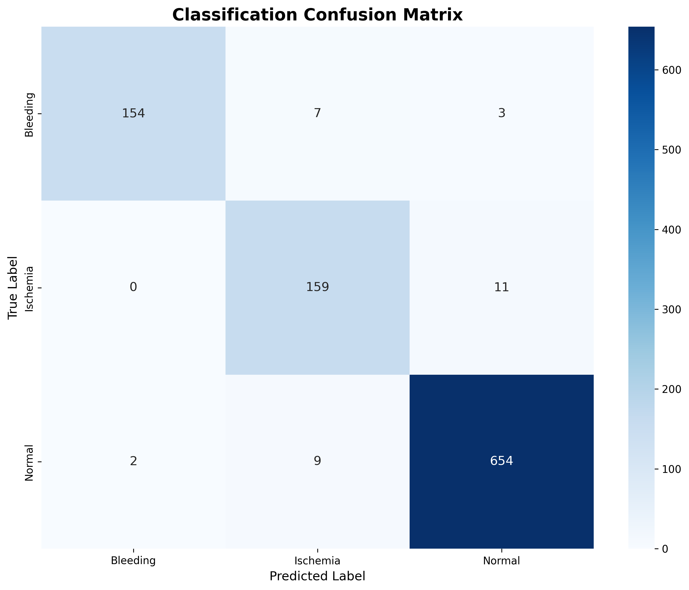
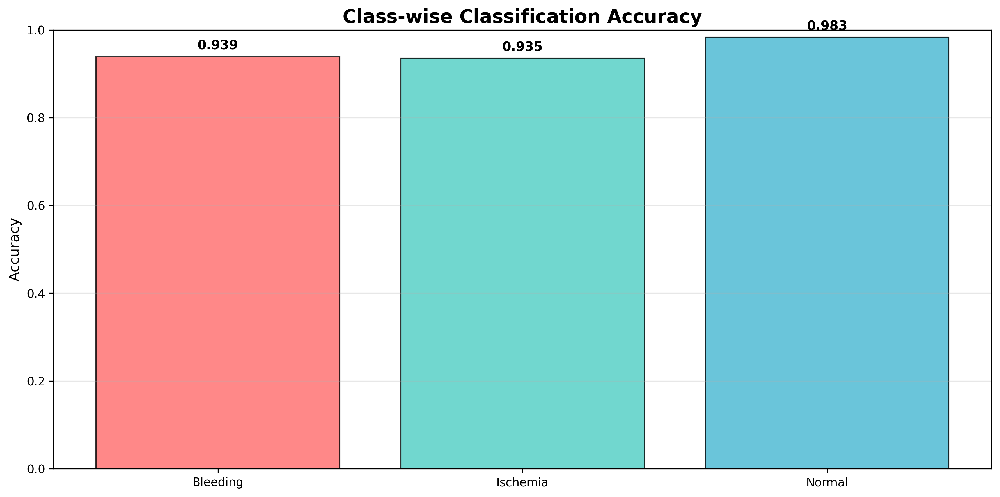
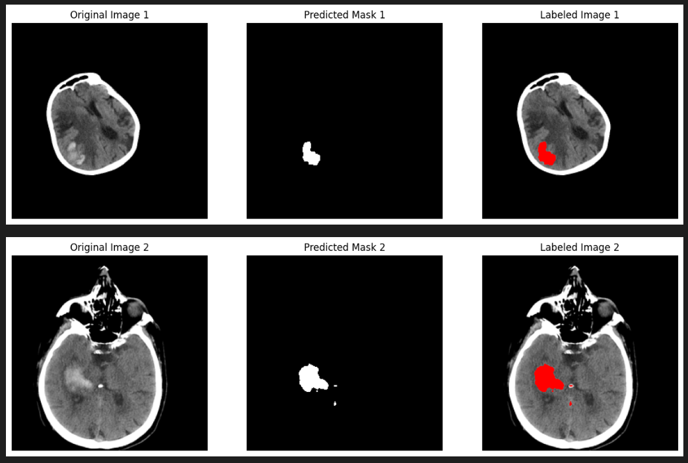

# 🧠 Deep Learning-Based Stroke Classification and Lesion Segmentation Using CT Images

## 📖 Abstract

Stroke is a major cause of mortality and long-term disability worldwide. Accurate classification of stroke type and precise localization of lesions are critical for effective treatment planning.

This project presents a **deep learning-based framework** for automated **stroke classification and lesion segmentation** using **CT brain images**.

The proposed system integrates two stages:

1️⃣ **Stroke Type Classification**
- Uses **transfer learning models (ConvNeXt / DenseNet)**
- Classifies CT images into:
  - Ischemic Stroke
  - Hemorrhagic Stroke
  - Normal

2️⃣ **Lesion Segmentation**
- Uses **U-Net architecture**
- Identifies and segments stroke-affected brain regions

Additional improvements include:

- Image preprocessing and augmentation
- Handling class imbalance
- Performance evaluation using **accuracy, precision, recall, specificity, and F1-score**

This system can function as a **clinical decision support tool** to assist radiologists in stroke detection and treatment planning.

**Keywords:** Stroke Detection, Deep Learning, Transfer Learning, U-Net, Medical Image Segmentation

---

# 🧠 Classification Pipeline

The classification module identifies the **type of stroke** present in the CT scan.



Steps involved:

1. CT scan input
2. Image preprocessing and normalization
3. Feature extraction using transfer learning models
4. Classification into stroke categories
5. Final prediction output

---

# 🧠 Segmentation Pipeline

After stroke detection, segmentation identifies the **exact lesion region**.



Segmentation workflow:

1. Input CT scan
2. Image preprocessing
3. U-Net segmentation model
4. Lesion mask prediction
5. Overlay segmented region on CT image

---

# 📂 Dataset

Dataset used in this project:

https://www.kaggle.com/datasets/ozguraslank/brain-stroke-ct-dataset

Dataset contains **CT brain images belonging to three classes**:

- Ischemia
- Hemorrhage (Bleeding)
- Normal

### Dataset Format

Dataset contains:

```
PNG images → CT scan images  
OVERLAY images → lesion masks
```

### Preprocessing Steps

- Dataset split into **Train / Validation / Test (70 / 15 / 15)**
- Image resizing and normalization
- Data augmentation
- Automatic **zero-mask creation for Normal images**

---

###Outputs


---
# ⚙️ Installation

Clone the repository

```bash
git clone https://github.com/chjayarajesh/Brain-Stroke-detection-and-Segmentation.git
cd Brain-Stroke-detection-and-Segmentation
```

Install dependencies

```bash
pip install -r requirements.txt
```

### requirements.txt

```
torch
torchvision
timm
scikit-learn
opencv-python
matplotlib
seaborn
numpy
pillow
```

---

# 🚀 Usage

### 1️⃣ Download Dataset

```bash
kaggle datasets download -d ozguraslank/brain-stroke-ct-dataset -p ./dataset
unzip dataset/brain-stroke-ct-dataset.zip -d ./dataset
```

---

### 2️⃣ Run Preprocessing

```bash
python preprocess.py
```

This step:

- Cleans dataset
- Splits dataset into train / validation / test
- Prepares segmentation masks

---

### 3️⃣ Train Classification Model

```bash
python train_classifier.py
```

Model predicts stroke type:

- Ischemia
- Hemorrhage
- Normal

---

### 4️⃣ Train Segmentation Model (U-Net)

```bash
python train_unet.py
```

U-Net predicts **lesion masks for stroke regions**.

---

### 5️⃣ Evaluate Results

Evaluation metrics used:

- Accuracy
- Precision
- Recall
- F1-Score
- Dice Score
- Intersection over Union (IoU)

---

# 📊 Classification Results

The confusion matrix below shows classification performance.



---

# 📈 Model Training Accuracy

The graph below shows the **training accuracy trend during training**.



---

# 🧠 Segmentation Results

Examples of segmented stroke lesions predicted by the U-Net model.



---

# 🎯 Key Features

✔ Deep learning-based stroke detection  
✔ Transfer learning for improved classification  
✔ U-Net architecture for lesion segmentation  
✔ Automated preprocessing pipeline  
✔ Visualization of predictions  
✔ High classification accuracy (>90%)

---

# 🔮 Future Improvements

- Apply **3D CNN models for volumetric CT scans**
- Deploy as a **web application**
- Integrate with **hospital PACS systems**
- Improve segmentation accuracy using **Attention U-Net**

---

# 👨‍💻 Author

**CH JAYA RAJESH**

GitHub  
https://github.com/chjayarajesh
